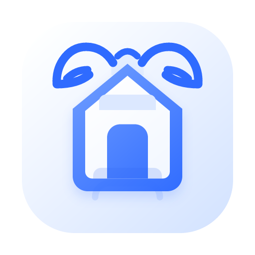
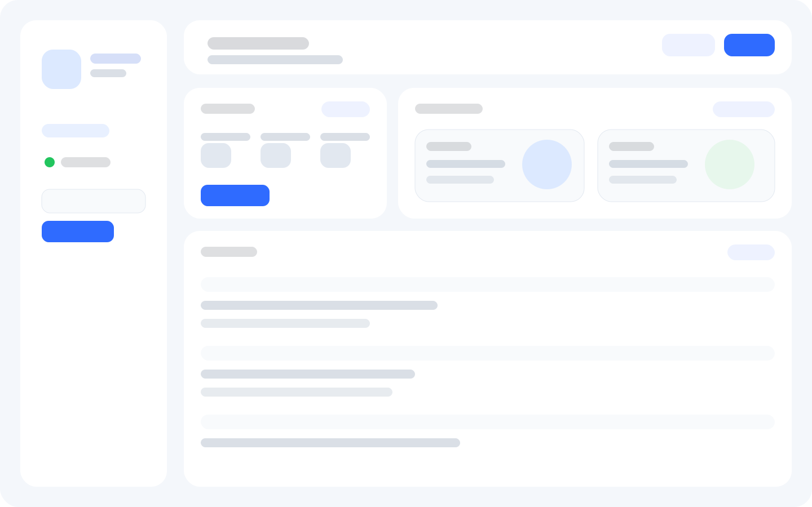
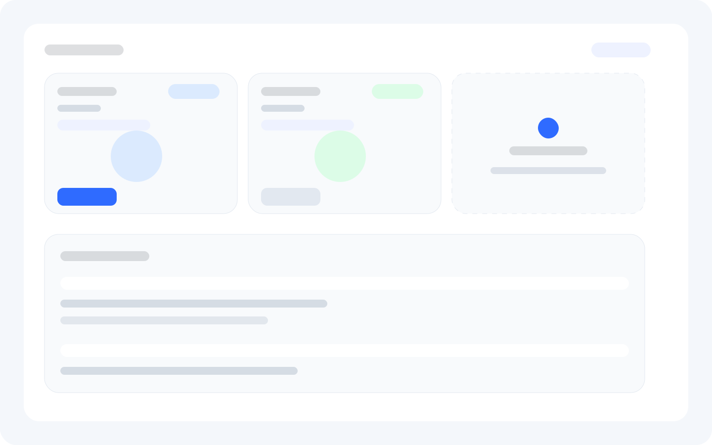
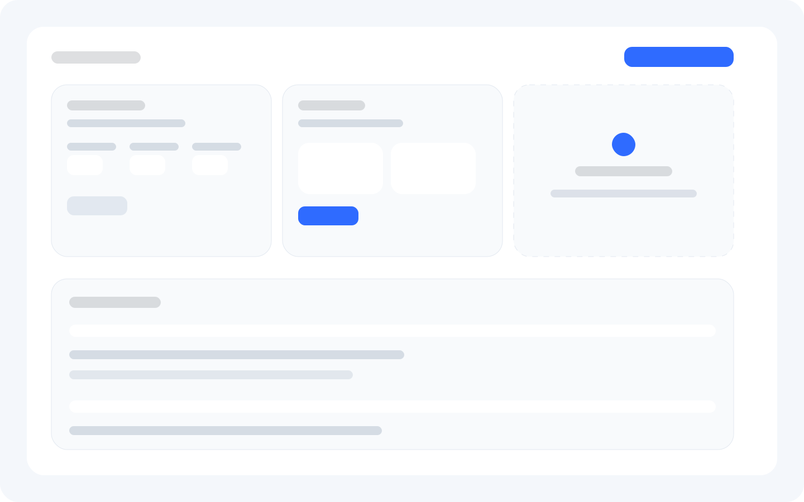

# Claw Home

<p align="center">
  
</p>

<p align="center">
  A friendly desktop control center for OpenClaw.
</p>

<p align="center">
  Built with Tauri + Vanilla JavaScript, focused on everyday users instead of operator-heavy dashboards.
</p>

## What Is Claw Home?

`Claw Home` is a desktop app for managing a local [OpenClaw](https://github.com/openclaw/openclaw) setup in a simpler, more approachable way.

Instead of exposing the full operator surface, Claw Home focuses on the actions normal users care about most:

- start and stop the local Gateway
- create and manage Agents
- switch model providers and models per Agent
- connect messaging apps to an Agent
- view local runtime health at a glance
- open the official OpenClaw chat UI in a dedicated window

## Why This Exists

OpenClaw is powerful, but many control surfaces still feel closer to an engineering console than a desktop product.

Claw Home explores a different direction:

- a friendlier visual layer
- lower-friction setup for local use
- clearer Agent management
- lightweight onboarding for non-technical users
- fun status feedback instead of dry machine labels

## Features

### Runtime control
- detect whether `openclaw` CLI exists locally
- detect whether the local Gateway is online
- one-click start / stop for Gateway
- onboarding flow for first-time setup

### Agent management
- create new Agents from a provider + model flow
- rename Agents
- change model provider / model for each Agent
- delete non-main Agents
- quick access to connect an app to an Agent

### Model management
- list configured providers
- list models under each provider
- add providers
- add models under a provider
- delete providers
- show default model and which Agents are using each model

### App connection flow
Currently includes guided connection flows for:

- Telegram
- Discord
- Feishu
- Slack
- WhatsApp
- WeChat personal account (experimental / community plugin flow)

### Agent activity view
- lightweight local Agent activity status
- playful per-Agent pet animation states
- local token usage visibility based on OpenClaw session data when usage is available

### OpenClaw chat handoff
- open the official local OpenClaw web chat in a separate Tauri window
- auto-load the local auth token when available

## Product Direction

Claw Home is intentionally **not** trying to replace the entire official OpenClaw control UI.

The current product split is:

- `Claw Home`: desktop control center for setup, models, agents, channels, and status
- `OpenClaw Web UI`: full chat and conversation surface

This keeps the desktop app focused and easier to use.

## Tech Stack

- [Tauri 2](https://tauri.app/)
- Vanilla HTML / CSS / JavaScript
- Rust backend commands for local OpenClaw orchestration

## Requirements

Before using Claw Home, you should have:

- macOS
- Node.js
- Rust toolchain
- a local OpenClaw installation

Claw Home works best when OpenClaw is already installed on the machine. The app can detect the local CLI and guide setup, but it is fundamentally a local OpenClaw companion app.

## Development

```bash
cd claw-home
npm install
npm run tauri dev
```

## Build

```bash
cd claw-home
npm run tauri build
```

Current macOS build output is typically generated under:

```bash
src-tauri/target/release/bundle/
```

## Project Structure

```text
claw-home/
├─ src/                 # frontend UI
├─ src-tauri/           # Tauri / Rust backend
├─ package.json
└─ README.md
```

## How It Works

Claw Home talks to the local OpenClaw environment in a pragmatic way:

- detects the local `openclaw` CLI
- reads local OpenClaw configuration when needed
- starts / stops the local Gateway
- loads dashboard data from the local machine
- opens the official local web chat UI when chat is needed

It is designed around **local-first control**, not remote multi-tenant administration.

## Current Notes

A few things are intentionally practical rather than perfect right now:

- token usage depends on whether the configured model provider actually returns usable usage data
- some channel flows depend on the quality and stability of OpenClaw plugins or third-party integrations
- distributed builds and code signing are not fully automated yet
- macOS Gatekeeper may block unsigned builds on other machines

## Roadmap

Planned or likely next improvements:

- better README visuals / screenshots
- GitHub Actions multi-platform builds
- stronger first-run onboarding
- more complete channel management
- optional internationalization workflow
- polished release packaging and signing

## Screenshots

### Dashboard Overview



### Agent Management



### Model Management



> Note: these preview visuals are generated from the current product structure and design system. They will be replaced with live runtime screenshots as the release materials are polished.

## Author

**FMouse**

## Contributing

Issues and pull requests are welcome.

If you open a PR, keeping the product direction in mind helps a lot:

- prioritize usability for normal users
- keep the UI lightweight and direct
- avoid turning Claw Home into a developer-only control panel

## License

[MIT](./LICENSE)
